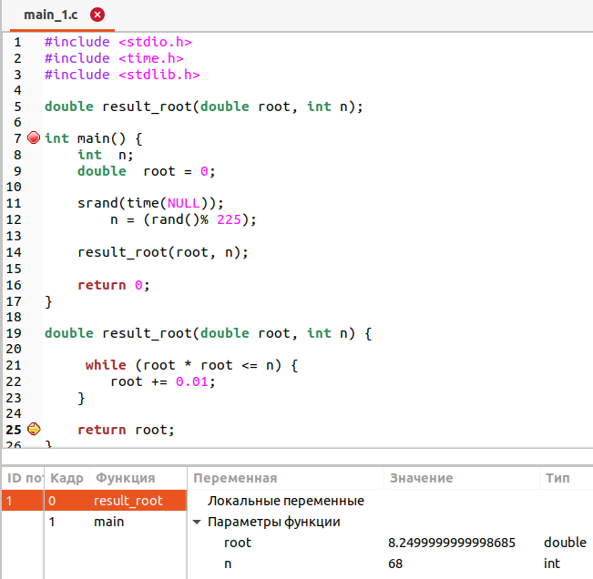

# Лабораторна робота №10. Вступ до документації
---
## 1 Вимоги
---
### 1.1 Розробник
* Михневич Владислав Вікторович 
* Студент 1-го курсу
* Групи КІТ-120а
### 1.2 Загальне завдання 
Розробити повноцінний звіт для лабораторної роботи функції
### 1.3 Індивідуальні завдання
* За допомогою функцій отримати корінь заданого числа.
* За допомогою функцій перемножити матрицю саму на себе.
* За допомогою варіативної функції визначити, скільки серед заданої послідовності чисел таких пар, у котрих перше число меньше наступного.
## 2 Описи програм
---
### 2.1 Програма main_1.c
---
#### 2.1.1 Функціональне призначення
Програма добуває квадратний корінь з числа за допомогою функції ``result_root()``. Результат зберігається у змінній ``root``. Демонстрація результату передбачає покрокове виконання програми.
#### 2.1.2 Опис логічної структури програми
* Для визначення квадратного кореня з чилса викликаємо функцію ``result_root()``, яка приймає параметр: число n з якого будет добуватись квадратний корінь. Функція збільшує значення параметру ``root`` на ``0.01`` поки значення ``root * root`` не буде дорівнювати заданому ``n``.

* Головна функція ``main()``. Задає випадкове число від 0 до 224. Викликає функцію ``result_root``. Функція, що добуває корінь з числа ``result_root``. Добуває квадратний корінь з числа. Параметри: ``n`` -- число, з якого потрібно добути корінь; ``root`` -- добутий корінь з заданого числа. Функція повертає ``root``. Схема алгоритму функції *(див. рис. 1)*.


Рисунок 1 -- Схема алгоритму функцій, завдання main_1.c

#### 2.1.3 Важливі фрагменти програми
* Генерація випадкового числа.
```
srand(time(NULL));
    n = (rand() % 225);
```
* Добування кореню за допомогою цикла.
```
while (root * root <= n) {
    root += 0.01; 
}
```
#### 2.1.4 Варіанти використання
З допомогою відлогадника ставимо точку зупинки на строках визову функції (для визначення початкового стану ) та ``return 0``, *(див. рис. 2,3)*.


Рисунок 2 -- Стан на початку функції в nemiver


Рисунок 3 -- Стан при завершенні функції в nemiver]

### 2.2 Програма main_2.c
---
#### 2.2.1 Функціональне призначення
Програма перемножує матрицю саму на себе за допомогою функції ``multiplication()``. Демонстрація результату передбачає покрокове виконання програми.
#### 2.2.2 Опис логічної структури програми
Для множення матриці викликаємо функцію ``multiplication()``, яка за допомогою циклів перемножує матрицю саму на себе, за правилом множення матриць. Схема алгоритму функції *(див. рис. 4)*.


Рисунок 4 -- Схема алгоритму функцій, завдання main_2.c

#### 2.2.3 Важливі фрагменти програми
* Підключення заголовочного ``stdlib.h`` та ``time.h`` для генерації випадкових чисел.
* Генерація випадкових чисел.
```
srand(time(NULL));
    for (int i = 0; i < SIZE; i++) {
        for (int j = 0; j < SIZE; j++) {
            matrix [i][j] = (rand() % 15);
        }
    }
```
* Виклик функції для множення матриці ``multiplication()``.
* Процес множення матриці саму на себе.
```
for (int i = 0; i < SIZE; i++) {
        for (int j = 0; j < SIZE; j++) {
            for (int k = 0; k < SIZE; k++) {
                results [i][j] += matrix [i][k] * matrix [k][j];
            }
        }
    }
```
#### 2.2.4 Варіанти використання
Для демонстрації результатів використовується покрокове виконання програми та інші засоби налагодження відлагодника nemiver, *(див. рис. 5)*.


Рисунок 5 -- Значення змінних в nemiver

### 2.3 Програма main_3.c
---
#### 2.3.1 Функціональне призначення
Програма, що визначає, скільки серед заданої послідовності чисел таких пар, у котрих перше число менше наступного за допомогою варіативної функції ``search``. 
#### 2.3.2 Опис логічної структури програми
Для визначення кількості пар чисел викликаємо функцію ``search(int numbers, ...)``, яка приймає параметр: число ``numbers`` -- кількість чисел в послідовності, та саму послідовність. Функція перевіряє кожен елемент ряду із усіма наступними, якщо елемент менший за один із наступних елементів то змінна ``result`` збільшується на один. Головна функція ``main()``. Викликає функцію ``search``, *(див. рис. 6)*.


Рисунок 6 -- Схема алгоритму функцій, завдання main_3.c

#### 2.3.3 Важливі фрагменти програми
* Підключення заголовочного файлу  ``<stdarg.h>`` для роботи з варіативними функціями.
* Виклик варіативної функції та генерація випадкових чисел.
```
int result = search(SIZE, rand() % 15, rand() % 15, rand() % 15, rand() % 15, rand() % 15, rand() % 15, rand() % 15);
```
* Процес знаходження кількості пар чисел.
```
for (int i = 0; i < SIZE; i++){
		int num2 = va_arg(factor, int);
		if (num1 < num2) {
		    result ++;
		}
		num1 = num2;
```
#### 2.3.4 Варіанти використання
Для демонстрації результатів використовується покрокове виконання програми та інші засоби налагодження відлагодника nemiver, *(див. рис. 7)*.


Рисунок 7 -- Значення змінних в nemiver

## 3 Структура проекту
---
```
.
├── dist
├── doc
│   ├── assets
│   │   ├── main_1 Nemiver 1.png
│   │   ├── main_1 Nemiver 2.png
│   │   ├── main_1.png
│   │   ├── main_2 Nemiver.png
│   │   ├── main_2.png
│   │   ├── main_3 Nemiver.png
│   │   └── main_3.png
│   ├── lab_10.docx
│   ├── lab_10.md
│   └── lab_10.pdf
├── Doxyfile
├── Makefile
└── src
    ├── main_1.c
    ├── main_2.c
    └── main_3.c
    
```
# Висновки
---
На цій лабораторній роботі ми навчилися розробляти звіт для лабораторних робіт, за допомогою Markdown та в doc форматі згідно ГОСТам


