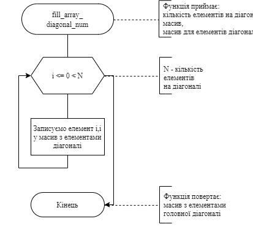
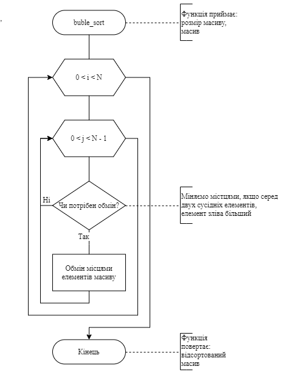
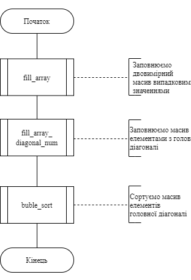
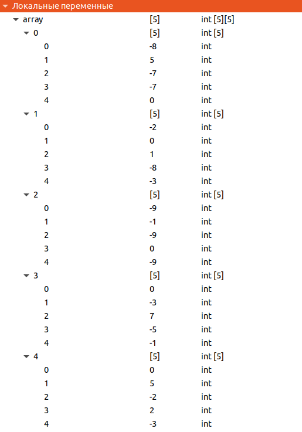
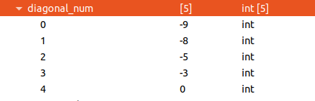

# Лабораторна робота №11. Вступ до показчиків
---
## 1 Вимоги
---
### 1.1 Розробник
* Михневич Владислав Вікторович 
* Студент 1-го курсу
* Групи КІТ-120а
### 1.2 Загальне завдання
Розробити програми, що вирішують завдання з використанням показчиків.
### 1.3 Індивідуальне завдання

* Реалізувати програму, що записує елементи головної діагоналі в одновимірний масив і упорядковує цей масив за зростанням.

## 2. Опис програми

### 2.1 Функціональне призначення

Програма записує елементи головної діагоналі двовимірного квадратного масиву ``array`` у масив ``main_diagonal_elements``. Далі елементи масиву ``main_diagonal_elements`` упорядковуються за зростанням.

### 2.2 Опис логічної структури програми

Для заповнення масиву ``main_diagonal_array`` викликаємо функцію ``fill_array__diagonal_num``, яка приймає параметрами розміри двовимірного масиву, показчик на двовимірний масив, показчик на масив з елементами головної діагоналі. Сортуємо масив за допомогою функції ``buble_sort``, яка приймає параметрами розмір масиву та показчик на масив.

##### Функція заповнення масиву елементами головної діагоналі двовимірного масиву

``int fill_array__diagonal_num``

_Призначення:_ заповнює масив елементами головної діагоналі двовимірного масиву

_Схема алгоритму функції_ подана на рис. 1.

_Опис роботи_: функція записує у i елемент масиву з елементами головної діагоналі, елементи двовимірного масиву з рівними індексами.



  
Рисунок 1 — Схема алгоритму функції ``fill_array``
##### Функція сортування
*void  buble_sort*

_Призначення:_ сортує масив за зростанням бульбашковим методом.

_Схема алгоритму функції_ подана на рис. 2.

_Опис роботи_: функція змінює місцями елементи, якщо елемент зліва більший за елемент справа.


 

Рисунок 2 - схема алгоритму функції сортування
##### _**Основна функція**_

``int main``

_Призначення:_ головна функція

_Схема алгоритму функції_ подана на рис. 3.

_Опис роботи:_ функція заповнює двовимірний масив випадковими елементами за допомогою функції ``fill_array``, заповнює функцію з елементами головної діагоналі за допомогою функції ``fill_array__diagonal_num``, і робить сортування масиву за допомогою функції ``buble_sort``.



Рисунок 3 — Схема алгоритму функції main

#### Структура проекту

```
├── doc
│   ├── assets
│   │   ├── buble_sort.png
│   │   ├── fill_array_diagonal_num.png
│   │   ├── fill_array.png
│   │   ├── get_random_num.png
│   │   └── main.png
│   ├── lab_11.docx
│   ├── lab_11.md
│   └── lab_11.pdf
├── Doxyfile
├── Makefile
└── src
    ├── main.c
    └── Task_1-3
        ├── Task_1.c
        ├── Task_2.c
        └── Task_3.c


```

### 2.3 Важливі фрагменти програми
#### Початкові дані. Константи
```c
#define SIZE 5
```
#### Запис елементів головної діагоналі
```c
for (int  i = 0; i < side_size; i++)
{
	main_diagonal_array[i] = square_array[i][i];
}
```
#### Зміна місцями елементів під час сортування
```c
array[j] += array[j + 1];
array[j + 1] = array[j] - array[j + 1];
array[j] -= array[j + 1];
```
### 3. Варіанти використання

Для демонстрації результатів використовується покрокове виконання програми та інші засоби налагодження відлагодника gdb. Нижче наводиться послідовність  дій запуску програми у режимі відлагодження.

Крок 1 (див. рис. 4). Знаходячись в основній процедурі, досліджуємо стан змінних, в тому числі констант.

 

Рисунок 4 — значення змінних при запуску програми


Крок 2 (див. рис. 5). Дослідження стану змінних після виконання функції сортування.

 

Рисунок 5 - значення змінних після сортування

## Висновки
---

На цій лабораторній роботі ми навчилися створювати показчик на масив, навчилися здійснювати виділення та звільнення пам'яті, та чому її потрібно звільнювати, а також вивчили операції які можуть застосовуватись до покажчиків.
