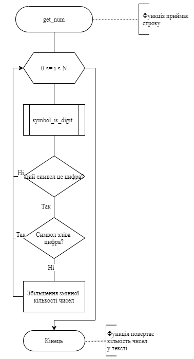
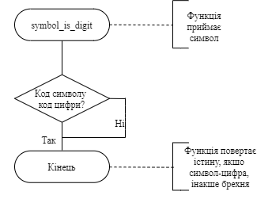
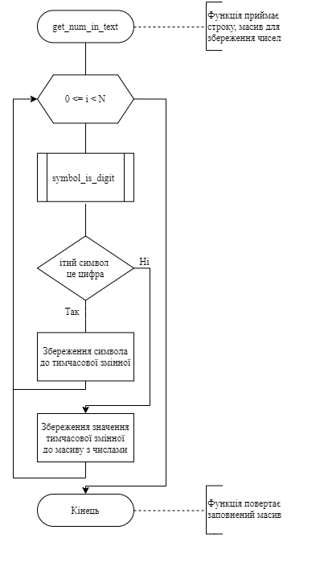
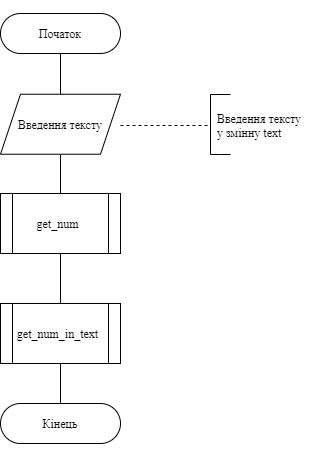

# Лабораторна робота №13. Строки (NULL-terminated C Strings)
---
## 1 Вимоги
---
### 1.1 Розробник
* Михневич Владислав Вікторович 
* Студент 1-го курсу
* Групи КІТ-120а
### 1.2 Загальне завдання
* Розробити програми, що вирішують завдання з використанням строк.
### 1.3 Індивідуальне завдання

* Реалізувати програму, знаходить усі числа у тексті.

## 2. Опис програми

### 2.1 Функціональне призначення

Програма записує усі числа із тексту text у масив numbers_in_text.

### 2.2 Опис логічної структури програми

Для створення масиву numbers_in_text визначаємо кількість чисел у тексті за допомогою функції get_count_of_numbers_in_text, яка приймає параметром текст. Для заповнення масиву числами викликаємо функцію get_numbers_in_text, яка приймає параметрами текст та масив для запису чисел.


##### Функція визначення кількості чисел у тексті
size_t get_count_of_numbers_in_text


_Призначення:_ визначає кількість чисел у тексті

_Схема алгоритму функції_ подана на рис. 1.

_Опис роботи_: за допомогою функції symbol_is_digit функція перевіряє чи є символ цифрою, якщо це цифра, то функція перевіряє чи зліва також цифра, якщо ні - збільшує кількість чисел у тексті.

Повертає функція кількість чисел у тексті.




Рисунок 1 — Схема алгоритму функції get_count_of_numbers_in_text

##### Функція перевірки символу
bool symbol_is_digit

_Призначення:_ визначає чи є символ цифрою.

_Схема алгоритму функції_ подана на рис. 2.

_Опис роботи_: функція перевіряє ASCII символу, і якщо цей код - код цифри, повертає істину, інакше - брехню.

Повертає функція true або false.

 

Рисунок 2 — Схема алгоритму функції symbol_is_digit

##### Функція запису чисел із тексту у масив
void get_numbers_in_text


_Призначення:_ записує усі числа із тексту у масив.

_Схема алгоритму функції_ подана на рис. 3.

_Опис роботи_: за допомогою функції symbol_is_digit функція перевіряє чи є символ цифрою, якщо це цифра, то до тимчасової змінної додається цей символ, якщо ні тимчасова змінна за допомогою функції atoi перетворюється у ціле число, яке записується у масив чисел.

Повертає функція змінений масив з числами.
Повертає функція true або false.

 

Рисунок 3 — Схема алгоритму функції get_num_in_text

##### _**Основна функція**_

``int main``

_Призначення:_ головна функція

_Схема алгоритму функції_ подана на рис. 4.

_Опис роботи:_ функція записує у змінну text строку, визначає кількість чисел у цьому тексті, створює масив для збереження чисел, записує усі числа у масив. Повертає функція код повернення програми (0).




Рисунок 4 — Схема алгоритму функції main

#### Структура проекту

```
├── doc
│   ├── assets
│   │   ├── get_num_in_text.png
│   │   ├── get_num.png
│   │   ├── main.png
│   │   └── symbol_is_digit.png
│   ├── lab_13.docx
│   ├── lab_13.md
│   └── lab_13.pdf
├── Doxyfile
├── Makefile
└── src
    ├── lib.c
    ├── lib.h
    └── main.c

```

### 2.3 Важливі фрагменти програми
#### Визначення чи є символ цифрою
```
if (symbol - '0' >= 0 && symbol - '0' <= 9)
```
#### Перевірка чи лівий елемент теж цифра
```if (symbol_is_digit(text[i])) {
	if (!is_in_number) {
		is_in_number = true;
		count_of_numbers++;
	}
}
```
#### Запис символів до тимчасової змінної
```
buffer[last_index_in_buffer] = text[i];
buffer[++last_index_in_buffer] = '\0';
```

## Висновки
---

На цій лабораторній роботі ми навчилися створювати показчик на масив, навчилися здійснювати виділення та звільнення пам'яті, та чому її потрібно звільнювати, а також вивчили операції які можуть застосовуватись до покажчиків.
